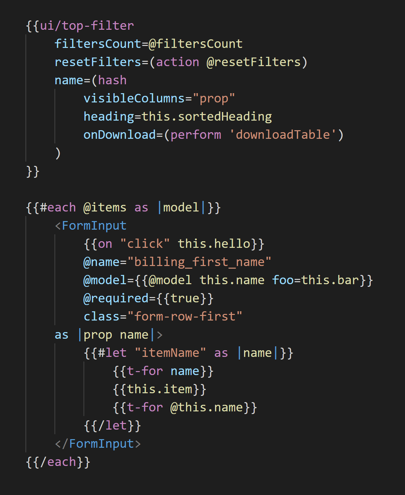
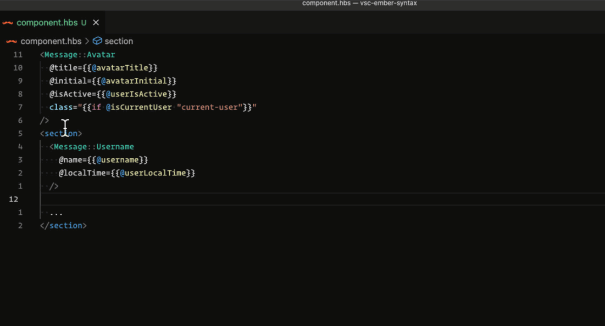

# README

VSCode Ember/Glimmer Syntax Extension.

Best with:

- [Unstable Ember Language Server](https://marketplace.visualstudio.com/items?itemName=lifeart.vscode-ember-unstable)
- [Prettier for Handlebars](https://marketplace.visualstudio.com/items?itemName=EmberTooling.prettier-for-handlebars-vscode)



Change Theme: `Shift+CMD+P` -> Search `Preferences: Color Theme` -> Switch to `Dark+ (default dark)`

Issues: https://github.com/lifeart/vsc-ember-syntax/issues

## Features

- Syntax highlighting of inline hbs blocks.
- IntelliSense for hbs tags and attributes.
- Quick info hovers on tags.
- Auto closing tags.
- Folding html.
- CSS completions in style blocks.
- Works with literal hbs strings that contain placeholders.
- `.gts` & `.gjs` template tag support

## Usage

The vsc-ember-syntax extension adds highlighting and IntelliSense for hbs template strings in JavaScript and TypeScript. It works out of the box when you use VS Code's built-in version of TypeScript.

### `.gts` & `.gjs` template tags

The extension adds new language definitions for `.gts` and `.gjs` known as `glimmer-ts` and `glimmer-js` respectively.
These languages are identical to `typescript` and `javascript` except that they add support for the template tag. This means that you can use the template tag in your code and get syntax highlighting and IntelliSense for the template.

```js
import Component from '@glimmer/component';

export default class MyComponent extends Component {
  get greeting() {
    return 'Hello';
  }

  <template>
    <div>{{this.greeting}} World!</div>
  </template>
}
```

Since the Typescript Language Server will not be running for these file types, you will need to add the following settings to your `settings.json` file to fill in the gaps. Consider installing [Glint](https://typed-ember.gitbook.io/glint/) to get type checking and hover information.

```jsonc
// add language specific settings
"[glimmer-js]": {
  "editor.defaultFormatter": "esbenp.prettier-vscode",
  "editor.foldingStrategy": "indentation"
},
"[glimmer-ts]": {
  "editor.defaultFormatter": "esbenp.prettier-vscode",
  "editor.foldingStrategy": "indentation"
},
// enable eslint for glimmer files
{
  "eslint.validate": [
    "glimmer-ts",
    "glimmer-js"
  ],
  "eslint.rules.customizations": [
    { "rule": "*", "severity": "warn" },
  ]
}
```

## Customizing the theme


In your vscode `settings.json` file:

```json
// https://code.visualstudio.com/docs/getstarted/themes
"editor.tokenColorCustomizations": {
    "textMateRules": [
        {
            "scope": [
                "text.html.handlebars meta.tag.any.handlebars entity.other.attribute-name.handlebars.argument",
            ],
            "settings": {
                "foreground": "#47c7b3",
            }
        }
    ]
}
```

If you are using VS Code 1.30 or older and are using a workspace version of typescript, you must currently configure the TS Server plugin manually by following these instructions

## Thanks to:

- [vscode-lit-html](https://github.com/mjbvz/vscode-lit-html)
- [Ember Syntax](https://marketplace.visualstudio.com/items?itemName=dhedgecock.ember-syntax)
- [VSCode Glimmer](https://marketplace.visualstudio.com/items?itemName=chiragpat.vscode-glimmer)
- [Grammar](https://macromates.com/manual/en/language_grammars)

How to publish: https://code.visualstudio.com/api/working-with-extensions/publishing-extension
